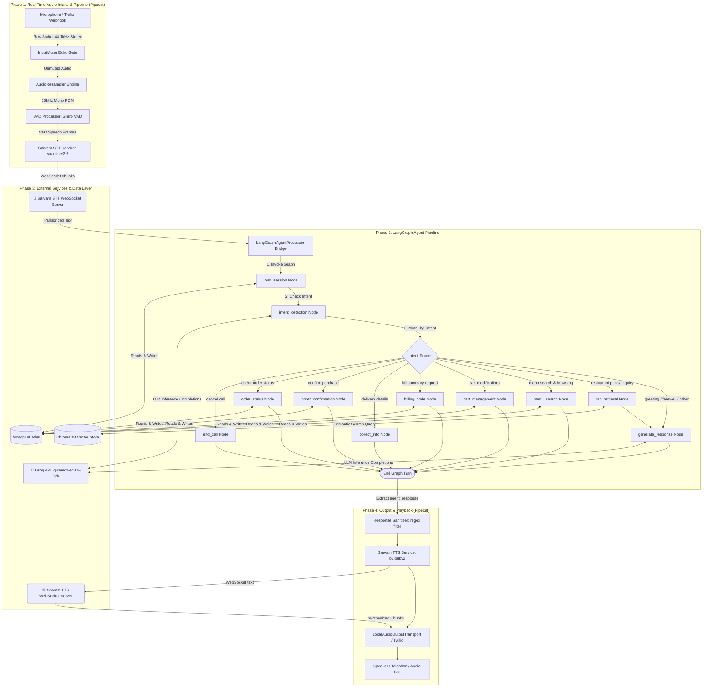

# Restaurant Voice Ordering Agent

A high-performance, real-time conversational AI voice ordering agent built for restaurants. This system leverages **Pipecat** for low-latency audio streaming pipelines and **LangGraph** for structured conversation state management, tool execution, and database persistence.

---

## 🎙️ Architecture & Workflow

The voice agent bridges real-time audio input/output with an LLM-driven state machine. Below is the complete, unified system flowchart representing the entire pipeline from audio intake to agent execution, external database queries, and speech synthesis playback:



### 1. Real-Time Streaming Pipeline (Pipecat)
*   **Audio Transport:** Handles audio ingestion. It runs locally via system audio devices (`LocalAudioTransport`) or in production via WebSockets connected to Twilio (`FastAPIWebsocketTransport`).
*   **Software Resampler (`AudioResampler`):** Opens physical microphones at native settings (e.g., `44100 Hz` stereo) to ensure driver compatibility on Windows, downmixing channels to mono and downsampling the signal to `16000 Hz` in software.
*   **Voice Activity Detection (VAD):** Employs `VADProcessor` wrapping `SileroVADAnalyzer` to detect when the user starts and stops speaking.
*   **Speech-to-Text (STT):** Streams mono audio over WebSockets to **Sarvam AI STT** (`saarika:v2.5` model) for concurrent speech decoding in English/Hindi.
*   **Text-to-Speech (TTS):** Converts plain text responses into streaming audio chunks using **Sarvam AI TTS** (`bulbul:v2` model with `anushka` voice).

### 2. Conversational Bridge (`LangGraphAgentProcessor`)
Bridges the streaming Pipecat pipeline with the LangGraph state machine. It intercepts final `TranscriptionFrame`s, invokes a graph turn, handles error fallbacks, and outputs the resulting text frame downstream to the TTS engine.

---

## 🤖 LangGraph State Machine

The conversation is modeled as a StateGraph (`restaurant_graph`) in [backend/agent/graph.py](file:///c:/Users/ujjwa/OneDrive/Desktop/voice-agent/backend/agent/graph.py). This enforces structure, validates order state in MongoDB, and executes tool logic. Refer to **Phase 2** of the unified workflow diagram above to visualize the complete graph routing and state transitions.

### State Definition (`AgentState`)
Defined in [backend/agent/state.py](file:///c:/Users/ujjwa/OneDrive/Desktop/voice-agent/backend/agent/state.py), the shared state object contains:
*   **Session info:** `call_id`, `session_id`, `customer_phone`.
*   **History:** `messages` list managed by LangGraph's `add_messages` reducer to automatically append user and assistant messages.
*   **RAG & Cart:** `retrieved_context`, `current_cart` contents, `order_state`, and customer memory.
*   **Response:** `agent_response` text and a `should_end` termination flag.

### Graph Nodes & Transitions
1.  **`load_session`:** Triggered at start. It queries or registers the customer's phone number in MongoDB and loads long-term memories.
2.  **`intent_detection`:** Classifies user intent (e.g. `add_to_cart`, `menu_search`) using the main LLM (`qwen/qwen3.6-27b` on Groq).
3.  **`rag_retrieval`:** If the user asks about restaurant hours, location, or FAQs, it retrieves context from the ChromaDB vector database.
4.  **`menu_search`:** Searches MongoDB menu collections for specific items or categories.
5.  **`cart_management`:** Adds items, removes items, or updates quantities in the database-backed cart.
6.  **`billing_node`:** Computes tax, delivery fees, and order totals, returning a plain-text billing summary.
7.  **`collect_info`:** Collects and updates the user's name and delivery address in the session.
8.  **`order_confirmation`:** Confirms the order in MongoDB and returns the finalized order receipt.
9.  **`order_status`:** Retrieves active order tracking updates from the database.
10. **`generate_response`:** General response node that combines conversation history, RAG context, and system instructions to formulate natural plain-text speech.
11. **`end_call`:** Generates a goodbye message and triggers a call hangup sequence.

---

## 🛠️ Performance Optimization & Quality Gates

*   **Acoustic Echo Suppression (`InputMuter`):** During local speaker testing, a custom muter processor detects `BotStartedSpeakingFrame` and silences microphone input. This prevents the bot's own voice from looping back through the speakers, eliminating chaotic self-interaction.
*   **Reasoning Strip-out:** Reasoning models like Qwen output internal plans inside `<think>...</think>` tags. The pipeline automatically strips these tags in python using regex before text hits the TTS, preventing the assistant from speaking its internal reasoning out loud.
*   **Type Conversions:** Automatic conversion filters map LangGraph's LangChain message records (like `HumanMessage` and `AIMessage`) into raw JSON dictionaries before passing them to the native Groq API, preventing runtime serialization crashes.
*   **Natural Conversational Prompting:** A strict system prompt bans markdown, bullet points, and code blocks, forcing the LLM to output highly brief, natural, conversational responses (typically under 15 words) suitable for high-speed voice synthesis.

---

## 🚀 Running Local Microphone Tests

To test the full voice pipeline, database tools, and agent reasoning locally on your machine using your microphone and speakers:

```powershell
# 1. Run with Headphones (Recommended: enables real-time user interruptions)
python test_local_mic.py --input 2 --headphones

# 2. Run with Speakers (Enables muting gate to prevent speaker feedback loop)
python test_local_mic.py --input 2
```

*Replace `--input 2` with your physical microphone index as listed in your console startup logs.*
